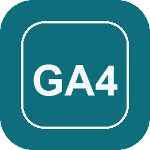

# GA4 Desk

<p align="center">
  
</p>

<p align="center">
  <strong>A free Google Analytics 4 guidebook</strong><br>
  Course · Academy · Resources · Coach · AI Skill<br>
  <em>Study companion — not Skillshop certification</em>
</p>

<p align="center">
  <a href="https://gtarafdar.github.io/ga4-guidebook/"></a>
  <a href="https://github.com/Gtarafdar/ga4-guidebook/stargazers"></a>
  <a href="downloads/ga4-business-toolkit.zip"></a>
</p>

<p align="center">
  <a href="https://gtarafdar.github.io/ga4-guidebook/">🌐 Live site</a> ·
  <a href="https://gtarafdar.github.io/ga4-guidebook/skill/">🧠 Skill page</a> ·
  <a href="downloads/ga4-business-toolkit.zip">⬇️ Download skill</a> ·
  <a href="https://github.com/Gtarafdar/ga4-guidebook">★ Star</a>
</p>

---

## About

**GA4 Desk** is a free, static learning desk for day-to-day [Google Analytics 4](https://support.google.com/analytics/) work. It is a **guidebook** — not a paid course clone and **not** official Google / Skillshop certification.

Use it when you want:

- a structured path with honest practice gates  
- an ungated library of the same material  
- tagged Official + Expert videos  
- a coach grounded in the same notes  
- a downloadable skill so Claude / Cursor stay on-script  

Built and maintained as open files on GitHub Pages. Screenshots come from Google’s public Merchandise Store demo. Practice questions are original.

> **Honest limit:** Passing the timed exam here does **not** certify you with Google. Use Skillshop for the real credential path.

---

## Quick links

| | |
|---|---|
| **Live site** | [gtarafdar.github.io/ga4-guidebook](https://gtarafdar.github.io/ga4-guidebook/) |
| **Course** | [Open Course](https://gtarafdar.github.io/ga4-guidebook/course/) |
| **Video Academy** | [Open Academy](https://gtarafdar.github.io/ga4-guidebook/academy/) |
| **Resources** | [Open library](https://gtarafdar.github.io/ga4-guidebook/resources/) |
| **Coach** | [Ask Coach](https://gtarafdar.github.io/ga4-guidebook/coach/) |
| **AI Skill** | [Skill details](https://gtarafdar.github.io/ga4-guidebook/skill/) · [Download zip](https://gtarafdar.github.io/ga4-guidebook/downloads/ga4-business-toolkit.zip) |
| **Settings** | [Voice & AI](https://gtarafdar.github.io/ga4-guidebook/settings/) |
| **Demo account** | [Join GA4 Merchandise Store demo](https://support.google.com/analytics/answer/6367342) |
| **Star** | [★ Star this repo](https://github.com/Gtarafdar/ga4-guidebook) |
| **Source** | [github.com/Gtarafdar/ga4-guidebook](https://github.com/Gtarafdar/ga4-guidebook) |

---

## What’s inside

| Door | What it helps with |
|------|--------------------|
| **Course** | Ordered chapters · Gate quizzes at **70%** · Timed rehearsal exam at **80%** after all gates · Progress on this device · Read-aloud |
| **Academy** | Official Skillshop + Expert videos, always tagged — no guessed IDs |
| **Resources** | Same curriculum as a searchable library — no syllabus pressure |
| **Coach** | Local search free · optional OpenRouter BYOK · skill-grounded answers |
| **Skill** | `ga4-business-toolkit` for Claude, Cursor, and other IDEs |

**At a glance:** 23 chapters · 494 practice questions · separate gate banks · deep-dive reference notes · animated concept diagrams.

---

## Download the AI skill

Ground Claude, Cursor, or similar IDEs in this guidebook instead of generic memory.

| Package | Link |
|---------|------|
| **Zip (recommended)** | [`downloads/ga4-business-toolkit.zip`](downloads/ga4-business-toolkit.zip) · [raw Pages URL](https://gtarafdar.github.io/ga4-guidebook/downloads/ga4-business-toolkit.zip) |
| **`.skill` alias** | [`ga4-business-toolkit.skill`](ga4-business-toolkit.skill) (same archive) |
| **Install guide** | [Skill page on the live site](https://gtarafdar.github.io/ga4-guidebook/skill/) · [source HTML](skill/index.html) |
| **Source notes** | [`data/skill/SKILL.md`](data/skill/SKILL.md) + [`data/skill/reference/`](data/skill/reference/) |

**Install (short):** download → unzip to `ga4-business-toolkit/` → drop into Claude skills or `~/.cursor/skills/` → ask a GA4 question.

Rebuild after editing skill notes:

```bash
python3 scripts/pack_skill.py
```

---

## Local preview

```bash
cd "Ga4 LMS"   # or your clone folder
python3 -m http.server 8000
```

Open [http://localhost:8000](http://localhost:8000)

---

## Course rules

1. Chapters unlock in order after you **pass that chapter’s Gate Quiz at 70%**.  
2. Gate questions live in `data/gates.json` — separate from the 494 practice questions.  
3. Practice stays available anytime a chapter is unlocked.  
4. Timed exam (**40Q / 40min / 80%**) opens only after **all chapters are passed**.  
5. Progress is stored in browser `localStorage` as `ga4lms_progress_v2`.

---

## Optional API keys (BYOK)

Keys stay in the visitor’s browser only — nothing is committed to the repo.

| Feature | Provider | Notes |
|---------|----------|--------|
| AI coach / screenshot help | [OpenRouter](https://openrouter.ai) | Enable in Coach / Settings. Prefer free models. |
| Nicer read-aloud | [ElevenLabs](https://elevenlabs.io) | Optional. Browser `speechSynthesis` is the free default. |

---

## Maintain / develop

```bash
python3 scripts/extract_content.py        # rebuild topics + screenshots from simulator HTML
python3 scripts/enrich_topics.py          # enrich thin chapters
python3 scripts/annotate_diagram_steps.py # diagram slideshow steps
python3 scripts/pack_skill.py             # zip + .skill for download
python3 scripts/smoke_check.py            # regression check
```

Keep `index.html` and `.nojekyll` at the repo root for Pages.

---

## About the maker

**Gobinda Tarafdar** — WordPress product marketer · stubborn problem-solver · lifelong Harry Potter devotee.

By day: Product Marketing Specialist at [WPBakery](https://wpbakery.com). Before that, helped a plugin cross **400,000+** active users. After hours: indie workshop tools (including this desk).

| | |
|---|---|
| GitHub | [github.com/Gtarafdar](https://github.com/Gtarafdar) |
| X | [x.com/Gtarafdarr](https://x.com/Gtarafdarr) |
| LinkedIn | [gobinda-tarafdar](https://www.linkedin.com/in/gobinda-tarafdar/) |
| Donate | [gtarafdar.com/donate](https://gtarafdar.com/donate) |
| Also | [Porter](https://gtarafdar.github.io/porter/) |

If GA4 Desk saves you a night of guesswork: **★ [star the repo](https://github.com/Gtarafdar/ga4-guidebook)** or [leave a tip](https://gtarafdar.com/donate).

---

## License & disclaimer

Free to use and share for learning. **Not affiliated with Google.** Not official Skillshop / Analytics certification. Verify limits and policies on [Google Analytics Help](https://support.google.com/analytics/) when stakes are high.
